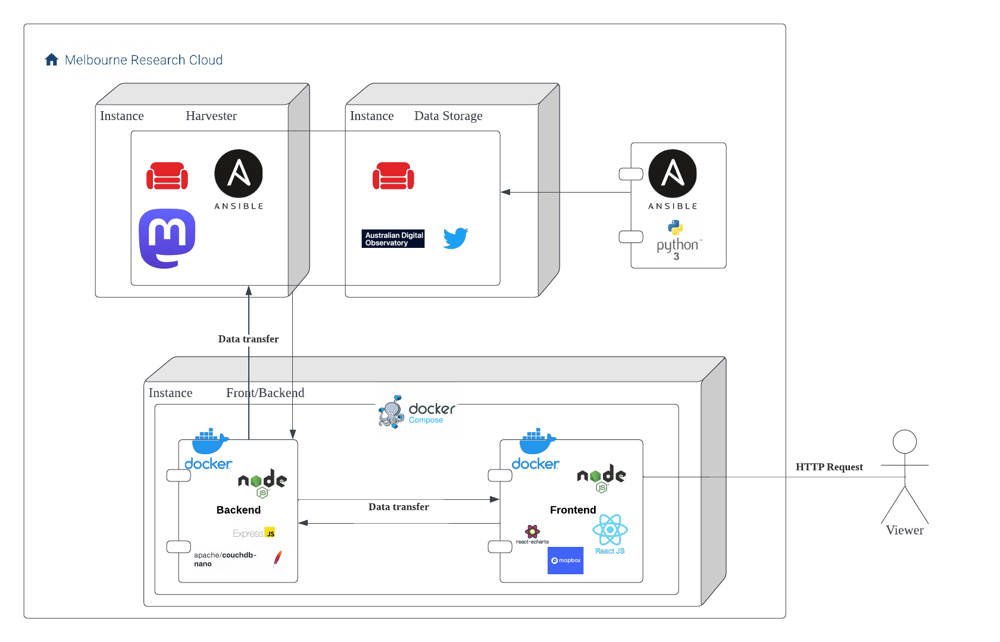
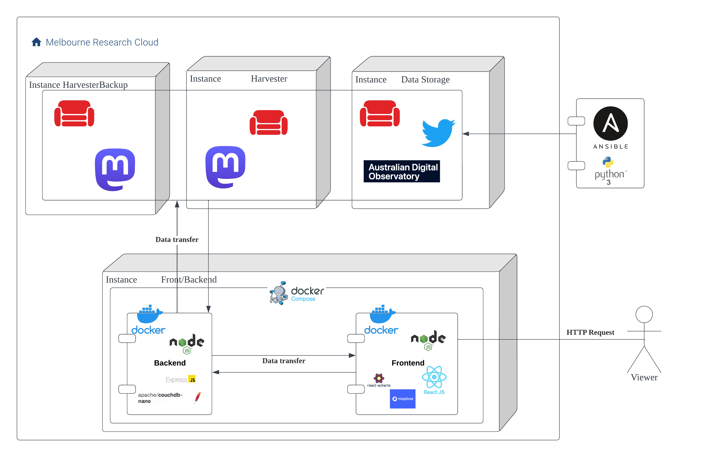

# COMP90024 
# Cluster and Cloud Computing 
**Web Application and Scenarios Demo** :rocket:  

<span style="color: grey">By - </span>Team 42


--- 
# Introduction

- our topic
- we aim to ...
  - main goal: sentiment analysis
- the data ...
  - data source
  - mastodon, twitter ...
- web application for demonstration


--- 
<!--_class: lead-->
# Architecture


---
<!--_class: lead-->
**System Design**



---
<!--_class: lead-->
**CouchDB**



---
# Harvester & Auto-scaling

We employed `Ansible` to deploy the harvester and auto-scaling system. By just one shell script, we auto scale up the harvester into new node of MRC.

```shell
sudo ./auto-scale-up.sh
```
Hello !!!
你的图片上去了


--- 
# Web Application

- Both the frontend and backend are already deployed on the cloud.
- `Docker` and `docker-compose` are used for app initilizaiton and running.  


**Live Demo**:
Make sure you are connecting the school network or UniMelb VPN.
Visit [172.26.128.31](http://172.26.128.31:3000/) for live demo of the web application.


---

<!--_class: lead-->
# Scenario 1 - Food


--- 
### Sentiment


- From inspection, about 4.43% of tweets mentioned food, and 45.82% of them showed a positive sentiment.
- Higher proportion of positive sentiment towards food compared to the overall positive sentiment.


--- 
### Food Topic Modeling
- image go here
- Among all these tweets about food, we try to find what people usually discuss by LDA topic modeling, we group what people discuss into 5 topics, and extract the key words for each topic.


---
<!--_class: lead-->

**So, What might affect people’s attitude towards food?**


---
#### Locations
- Statistical Area Level 4 (SA4) is used to divides the map into 86 polygons, each represents a SA4 area.
- People in XXX are more likely to tweet about food
- However, this may be explained by the number of restaurants in the large city.


--- 

#### Incomes

- We try to see if people’s attitudes towards food is also related to their income
- There is no significant correlation between the income and the number of tweets about food for each SA4 area.


---


- But people in XXX city have a greater positive attitude towards food, while people in XXX city have a more negative attitude towards food.


---
<!--_class: lead-->
# Scenario 2 - Traffic


--- 


---
<!--_class: lead-->
# Scenario 3 - Sport


---


---
# Mastodon
Because of the limit amount of data we can get from Mastodon, we only use it to compare with the findings from Twitter. 

Topic classification and sentiment analysis are performed on the harvested data.

*We use the data from mutiple Mastodon servers:*
- au
- au-social
- XXX

---


--- 
<!--_class: lead-->
## Thank you ! :heart:
